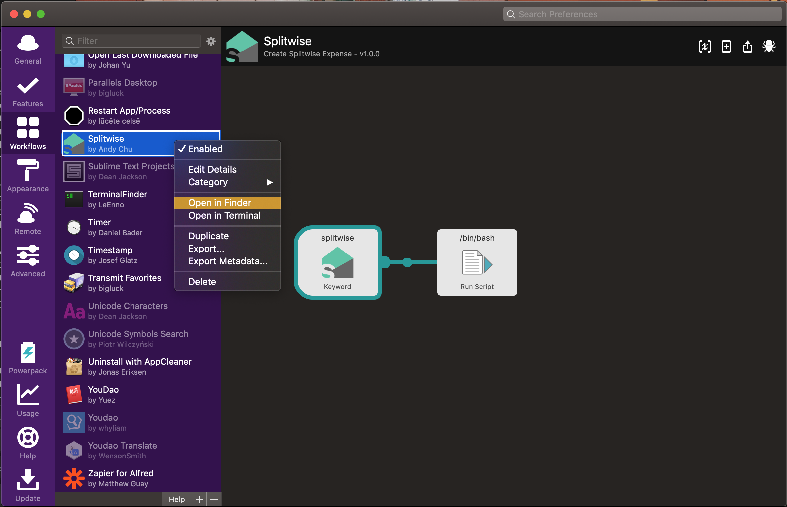
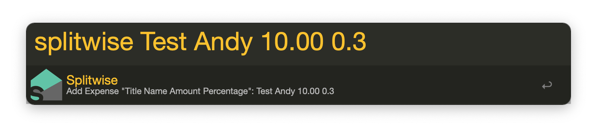

# Splitwise Alfred Workflow
This is a Alfred workflow for adding expense quickly to your Splitwise account. And thanks for https://github.com/namaggarwal/splitwise for providing SDK for Splitwise API.

# Installation

1. You should register your application at [Splitwise](https://secure.splitwise.com/oauth_clients) and get your consumer key and consumer secret.

2. Install Splitwise SDK and pyinstaller using pip:

   ```bash
   pip install splitwise
   ```

   ```bash
   pip install pyinstaller
   ```

3. Clone this repository.

4. Import Splitwise.alfredworkflow to your alfred.

5. Replace parameters in [GetAccessToken.py](http://getaccesstoken.py/) and get your Splitwise access token.

6. Replace parameters in [AddExpense.py](http://addexpense.py/)

7. Run pyinstaller [AddExpense.py](http://addexpense.py/) in the project directory to get a packaged executive.

8. And copy the AddExpense folder under the dist folder to Alfred workflow's directory.

   

9. You're good to go!

# Usage

You can simply type "Splitwise Title Name Amount Percentage" in Alfred to add expense to your Splitwise account.

Title: The name of your spending.

Name: The person you are splitting money with.

Amount: The total amount of the expense.

Percentage: The total share that you own. E.g. If the amount is \$10, by typing 0.2 means that you should pay ​\$2 out of the $10. If didn't mention, the default value is to split in half (50%).

